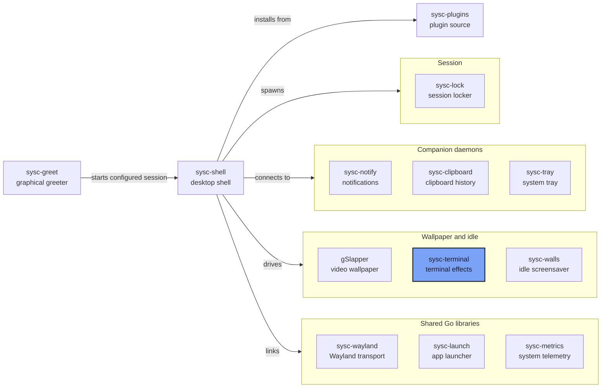

Live sysc-Go terminal effects as a Wayland wallpaper. Runs on Niri's background layer,
with one process per output.

## Quick Links

- [Documentation](#documentation)
- [The sysc ecosystem](https://github.com/Nomadcxx/sysc-shell/blob/main/docs/ecosystem.md)

## Installation

Runtime rendering needs a monospace font with braille coverage. The default search checks
JetBrains Mono (Nerd Font first), then DejaVu Sans Mono and Noto Sans Mono, under
`/usr/share/fonts/`, `/usr/local/share/fonts/` and the Nix store profile — matching both the
Arch/Nix `TTF/` layout and the Debian/Ubuntu `truetype/` layout — then falls back to any font
file found under those roots. Use `--font /path/to/font.ttf` for another location.

```bash
GOBIN="$HOME/.local/bin" CGO_ENABLED=0 go install github.com/Nomadcxx/sysc-terminal/cmd/sysc-terminal@main
export PATH="$HOME/.local/bin:$PATH"
sysc-terminal --list
```

Keep `~/.local/bin` on the PATH of the shell service, then restart sysc-shell so it probes the
catalog. In sysc-shell, open Terminal Art from the Control Centre or Settings, choose an effect and
palette, and apply it to an output.

## Usage

```bash
sysc-terminal --output eDP-1 --effect fire --theme nord --ipc-socket "$XDG_RUNTIME_DIR/sysc-terminal.sock"
```

Get the connector from `niri msg outputs`. Run one process per output with a distinct socket.

Socket verbs: `query`, `pause`, `resume`, `change effect <id> theme <theme> [file <path>]`,
`reset`, `stop`. A paused process keeps its last frame.

## Rendering

- `wlr-layer-shell` Background surface, namespace `sysc-terminal`
- Bounded ANSI cell grid with a subset of SGR colour, wide-rune handling, and caps on frame bytes
  and cells
- Font rasterisation with a glyph cache, into double-buffered `wl_shm` ARGB8888 buffers
- 20 FPS ceiling; the warmed `fire`/`nord` frame check at 3440×1440 targets less than 25% of one
  CPU core (mean and p95). CPU use varies with effect, font, output and hardware.
- One process per output, each with its own socket
- `--list` reports the effect IDs, themes and text effects from the live sysc-Go registry
- Text effects accept `--file`

## Build

Pins Go 1.26, sysc-Go `v1.0.4-0.20261004042739-c80d48f1f38e` and sysc-wayland `v0.3.1`. Niri
first, no CGO.

```bash
go generate ./internal/wayland/...
timeout 90s env CGO_ENABLED=0 GOMAXPROCS=2 go build -o /tmp/sysc-terminal ./cmd/sysc-terminal
```

Tests are named and run individually; the full tree and `-race` are not run on the development
laptop.

## Ecosystem



[The sysc ecosystem](https://github.com/Nomadcxx/sysc-shell/blob/main/docs/ecosystem.md) explains
each connection, socket and version pin.

## Documentation

- [The sysc ecosystem](https://github.com/Nomadcxx/sysc-shell/blob/main/docs/ecosystem.md)
- [docs/plans](docs/plans) — design and feasibility notes

## License

MIT. Effects come from [sysc-Go](https://github.com/Nomadcxx/sysc-Go) (MIT); transport from
[sysc-wayland](https://github.com/Nomadcxx/sysc-wayland) (BSD-3-Clause).

---

<a href="https://github.com/Nomadcxx"></a> — terminal-native tooling for the linux desktop.
[More projects →](https://github.com/Nomadcxx) · [Sponsor](https://github.com/sponsors/Nomadcxx) ❤️
